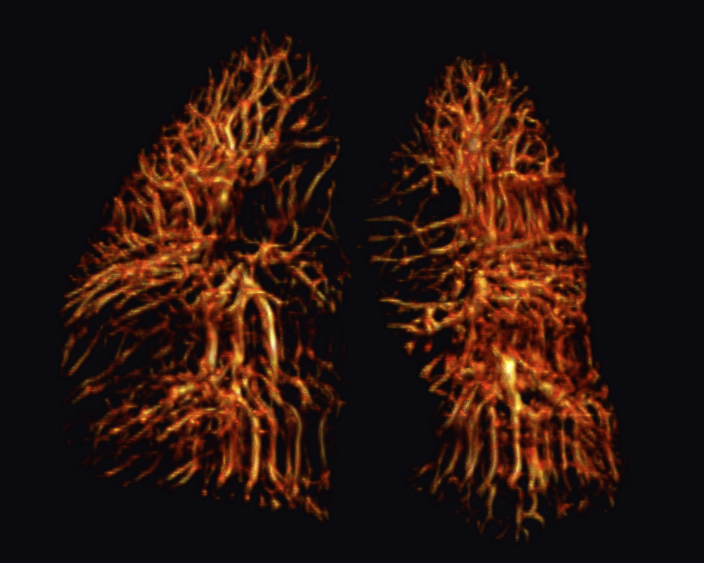
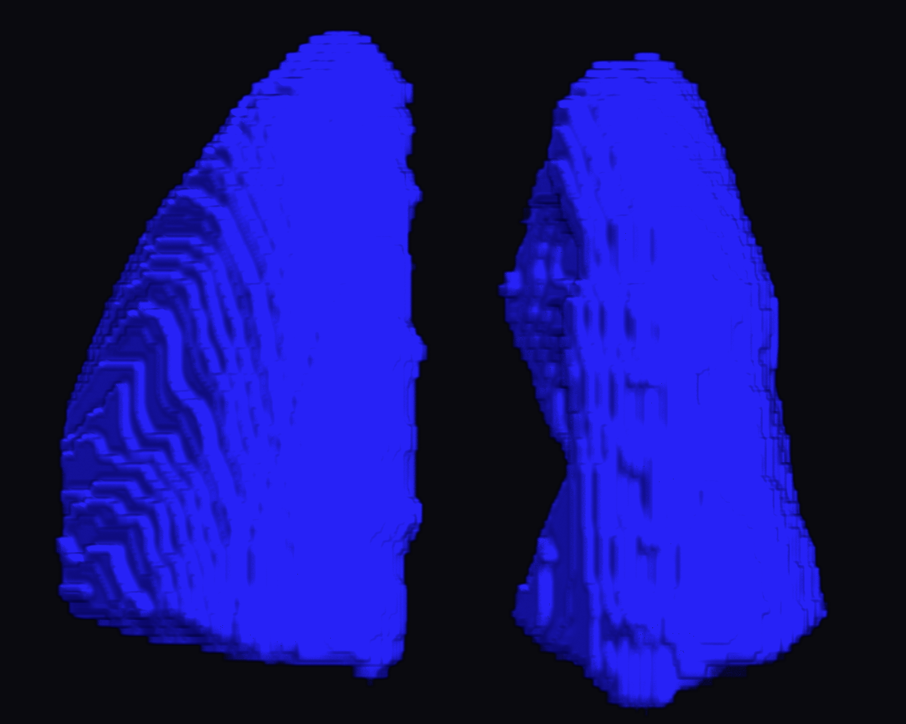
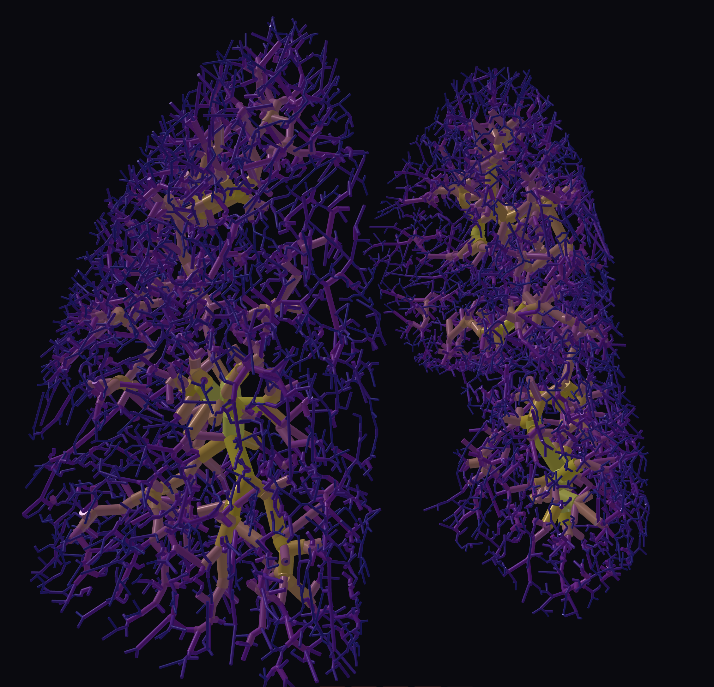

# PulmoVesselGraph

**Deterministic CT-based pulmonary vascular tree reconstruction, skeletonization, graph construction, and morphometric analysis.**

<p align="center">
  
  
  
</p>

<p align="center">
  <em>From DICOM chest CT to lung masks, vesselness-enhanced vasculature, TEASAR centerlines, NetworkX graphs, and morphometric descriptors.</em>
</p>

---

## Overview

`PulmoVesselGraph` is an explainable, training-free Python pipeline for reconstructing and analyzing the pulmonary vascular tree from clinical chest CT data. It combines classical image processing, multiscale vesselness enhancement, TEASAR skeletonization, graph construction, and vascular morphometry into a stage-based workflow.

The repository is designed for research scenarios in which voxel-level annotations are unavailable, deep learning training is not feasible, or a transparent reconstruction pipeline is preferred. The implementation is organized as a reproducible sequence of stages controlled through `config/config.py` and executed from `main.py`.

---

## What the pipeline does

```text
DICOM CT series
      │
      ▼
Stage 00: DICOM loading, HU conversion, isotropic resampling
      │
      ▼
Stage 01: Lung segmentation
HU thresholding → morphology → Chan--Vese refinement → lung-wall exclusion
      │
      ▼
Stage 02: Anisotropic diffusion
noise reduction while preserving vascular structures
      │
      ▼
Stage 03: Multiscale vesselness filtering
Frangi + Sato + optional Jerman responses across 1.0--8.0 mm scales
      │
      ▼
Stage 04: TEASAR skeleton extraction
left/right vessel masks, Euclidean distance maps, centerlines
      │
      ▼
Stage 05: Graph construction
NetworkX vascular graphs, pruning, cycle removal, component cleanup
      │
      ▼
Stage 06: Morphometric analysis
fractal dimension, Strahler order, Horton ratios, Murray exponent, tortuosity
```

---

## Example outputs

### Vesselness-enhanced pulmonary vasculature

<p align="center">
  
</p>

Multiscale Hessian-based filtering enhances tubular pulmonary vascular structures across a broad diameter range. The default configuration fuses Frangi and Sato responses, with optional Jerman weighting available in the configuration.

### Segmented lung volume

<p align="center">
  
</p>

The lung mask is extracted from CT Hounsfield units using intensity thresholds, morphological post-processing, connected-component handling, and active-contour refinement.

### Pulmonary vascular graph

<p align="center">
  
</p>

The final representation consists of separate left and right spatial vascular graphs. Nodes and edges encode topology, centerline geometry, branch paths, length, and radius-related attributes used for downstream morphometric analysis.

---

## Repository structure

```text
PulmoVesselGraph/
├── main.py                         # main stage-by-stage pipeline entry point
├── requirements.txt                # Python 3.11 dependencies
├── LICENSE                         # MIT license
├── README.md
├── config/
│   ├── __init__.py
│   └── config.py                   # PipelineConfig: paths, thresholds, weights, viewers
├── img/
│   ├── p1.png                      # segmented lung volume
│   ├── p2.png                      # vesselness-enhanced vasculature
│   └── p3.png                      # reconstructed vascular graph
└── modules/
    ├── __init__.py
    ├── cache_manager.py            # stage caching utilities
    ├── napari_viewer.py            # interactive Napari visualization
    ├── pyvista_viewer.py           # 3D PyVista graph/vesselness visualization
    ├── stage_00_dicom_load.py      # DICOM loading, HU conversion, resampling
    ├── stage_01_lung_segmentation.py
    ├── stage_02_anisotropic_diffusion.py
    ├── stage_03_vesselness.py
    ├── stage_04_vessel_graph.py    # vessel mask and TEASAR skeleton extraction
    ├── stage_05_graph_construction.py
    └── stage_06_morphometric_analysis.py
```

---

## Key features

- **Training-free pulmonary vascular reconstruction** — no voxel-level manual annotations are required.
- **Explainable processing chain** — each stage is deterministic, parameterized, and inspectable.
- **DICOM-to-graph workflow** — the pipeline starts from a DICOM CT series and ends with left/right pulmonary vascular graphs.
- **Multiscale vesselness filtering** — default scales cover `1.0, 1.5, 2.0, 2.5, 3.0, 3.5, 4.0, 4.5, 5.0, 5.5, 7.0, 8.0` mm.
- **Filter fusion** — Frangi, Sato, and optional Jerman vesselness maps can be weighted and fused.
- **TEASAR centerline extraction** — skeletons are generated using the Kimimaro implementation of TEASAR.
- **Graph-based vascular modeling** — skeletons are converted into cleaned `NetworkX` graphs.
- **Morphometric analysis** — outputs include fractal dimension, volumetric fractal dimension, Strahler orders, Horton ratios, Murray exponent, tortuosity, bifurcation counts, and asymmetry ratio.
- **Interactive visualization** — optional Napari and PyVista viewers are integrated into the workflow.

---

## Installation

The project is intended for **Python 3.11**.

```bash
git clone https://github.com/rroszczyk/PulmoVesselGraph.git
cd PulmoVesselGraph

python -m venv .venv
source .venv/bin/activate      # Linux/macOS
# .venv\Scripts\activate       # Windows

pip install --upgrade pip
pip install -r requirements.txt
```

The current `requirements.txt` includes:

```text
numpy
scipy
scikit-image
pydicom
nibabel
kimimaro
crackle-codec
networkx
skan
pandas
matplotlib
napari[pyqt5]
PyOpenGL
PyOpenGL_accelerate
pyvista
```

---

## Configuration

All runtime settings are currently defined in `config/config.py` inside the `PipelineConfig` dataclass.

At minimum, adjust the input DICOM path and series identifier before running:

```python
# config/config.py

dicom_dir = r"path/to/dicom/folder"
dicom_series = "series_name_or_id"
cache_dir = "cache"
output_dir = "outputs"
```

Important parameters include:

| Parameter | Default | Meaning |
|---|---:|---|
| `iso_spacing` | `(1.0, 1.0, 1.0)` | isotropic resampling spacing in mm |
| `lung_low`, `lung_high` | `-1000`, `-400` | HU range for lung parenchyma segmentation |
| `use_refine` | `True` | enables Chan--Vese refinement |
| `diff_n_iter` | `5` | anisotropic diffusion iterations |
| `vessel_sigmas` | `1.0--8.0` | multiscale vesselness radii/scales |
| `frangi_weight` | `1.0` | Frangi vesselness contribution |
| `sato_weight` | `1.2` | Sato vesselness contribution |
| `jerman_weight` | `0` | optional Jerman vesselness contribution |
| `vesselness_threshold` | `0.15` | threshold used before skeletonization |
| `teasar_scale` | `1.5` | TEASAR invalidation-radius scale |
| `teasar_const` | `0.5` | TEASAR minimum invalidation radius |
| `min_spur_length_mm` | `2.0` | pruning threshold for short terminal branches |
| `fractal_scales` | `[2, 4, 8, 16, 32, 64]` | box sizes for fractal-dimension estimation |
| `show_napari` | `True` | enables Napari stage visualization |
| `show_pyvista` | `True` | enables PyVista 3D visualization |

For non-interactive or headless execution, set:

```python
show_napari = False
show_pyvista = False
```

---

## Running the pipeline

After editing `config/config.py`, run:

```bash
python main.py
```

The pipeline uses a stage cache, so repeated runs can reuse previous intermediate results when parameters have not changed.

### Visual inspection by stage

To inspect intermediate results in Napari, use:

```python
show_napari = True
napari_3d = True
napari_after_stage = 3   # choose 0--6, or -1 for final visualization
```

Available stage indices:

| Index | Stage |
|---:|---|
| `0` | raw CT after DICOM loading and resampling |
| `1` | lung segmentation |
| `2` | anisotropic diffusion |
| `3` | vesselness filtering |
| `4` | skeleton extraction |
| `5` | graph construction |
| `6` | morphometric analysis |
| `-1` | final visualization |

---

## Outputs

The main pipeline writes NIfTI volumes and morphometric files to `outputs/` by default.

Typical volume outputs include:

```text
outputs/
├── s00_hu_iso.nii.gz
├── s01_lung_mask.nii.gz
├── s01_lung_mask_eroded.nii.gz
├── s02_smoothed_hu.nii.gz
├── s03_vesselness_final.nii.gz
├── s03_vesselness_fused.nii.gz
├── s03_map_frangi.nii.gz
├── s03_map_sato.nii.gz
├── s03_map_jerman.nii.gz
├── s03_vessel_mask.nii.gz
├── s04_skeleton_left.nii.gz
├── s04_skeleton_right.nii.gz
├── s04_skeleton_combined.nii.gz
├── s04_edt_left.nii.gz
├── s04_edt_right.nii.gz
├── s04_left_mask.nii.gz
└── s04_right_mask.nii.gz
```

Stage 06 additionally exports graph and morphometry files:

```text
outputs/
├── graph_LEFT.graphml
├── graph_RIGHT.graphml
├── morphometry_LEFT.csv
├── morphometry_RIGHT.csv
└── morphometry_summary.json
```

---

## Morphometric descriptors

`stage_06_morphometric_analysis.py` computes descriptors for the left and right vascular trees separately.

| Descriptor | Purpose |
|---|---|
| **Skeleton fractal dimension** | box-counting complexity of the one-voxel centerline tree |
| **Volumetric fractal dimension** | box-counting complexity of an EDT-inflated vessel volume |
| **Strahler order** | hierarchical branching order of the tree |
| **Horton ratios** | branching, length, and diameter ratios across orders |
| **Murray exponent** | radius-scaling exponent estimated at bifurcations |
| **Diameter index** | distal-to-proximal diameter relationship |
| **Tortuosity** | edge path length relative to straight-line distance |
| **Bifurcation counts** | number of 3-way, 4-way, and higher-degree branch points |
| **Asymmetry ratio** | daughter-branch radius imbalance at bifurcations |
| **Cycle/component counts** | topological quality-control indicators |

---

## Reproducibility notes

The pipeline is deterministic once the input data and parameters are fixed. For reproducible experiments, report at least:

- CT acquisition protocol and reconstructed voxel spacing,
- isotropic resampling spacing,
- lung segmentation HU thresholds,
- Chan--Vese refinement settings,
- anisotropic diffusion settings,
- vesselness scales and filter weights,
- vesselness threshold,
- TEASAR parameters,
- graph pruning thresholds,
- fractal-dimension box sizes,
- whether Napari/PyVista inspection was used only for visualization or also for parameter tuning.

Clinical CT data are often not redistributable. If the source scans cannot be released, publishing the configuration file, output schema, and representative figures can still improve methodological transparency.

---

## Data availability

This repository does not include clinical CT data. Users must provide their own DICOM CT series and ensure that all imaging data are handled according to institutional review board requirements, local regulations, and patient privacy rules.

---

## Citation

If you use this repository in academic work, please cite the associated manuscript:

```bibtex
@article{pulmovesselgraph,
      title={Spatial Graph Representation and Morphometric Analysis of the Pulmonary Vascular Tree From Computed Tomography Using Multi-Scale Hessian-Based Filter Fusion and TEASAR Skeletonization}, 
      author={Piotr Mackiewicz and Jakub Kołyska and Radoslaw Roszczyk},
      year={2026},
      url={https://arxiv.org/abs/2607.04457}, 
}
```

---

## Suggested GitHub topics

`pulmonary-vessels` · `computed-tomography` · `medical-imaging` · `vesselness-filtering` · `frangi-filter` · `sato-filter` · `teasar` · `vascular-graph` · `networkx` · `morphometry` · `fractal-analysis` · `strahler-ordering`

---

## License

This project is released under the MIT License. See [`LICENSE`](LICENSE) for details.

---

## Disclaimer

This software is intended for research use only. It is not a certified medical device and must not be used for clinical diagnosis, treatment planning, or patient management without appropriate validation and regulatory approval.
